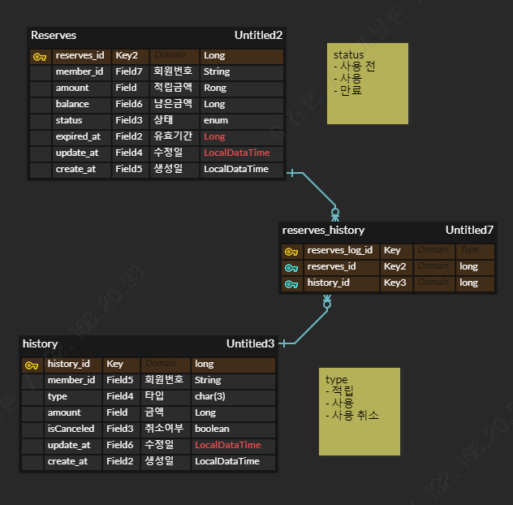

## 적립금 API 구현 
- 일정 상 진행 하지 못했던 과제, 현업에서 사용하지 못해보았던 기술을 조금이지만 사용해 볼 수 있어 재밌었다.

### erd

- 사용 취소 API를 고려하여, 다대다 테이블로 설계 하였습니다.
  - history에서 사용 취소 시, 여러 Reserves를 Rollback 하기 위함

### API
1. 적립금 적립
2. 적립금 합계 조회
3. 적릭금 사용
4. 적립/사용 내역 조회
5. 사용취소

### 실행방법 (IntelliJ IDEA)
1. git clone
2. Q파일 생성 (gradle - other - complieQueryDsl)
3. application 구동
